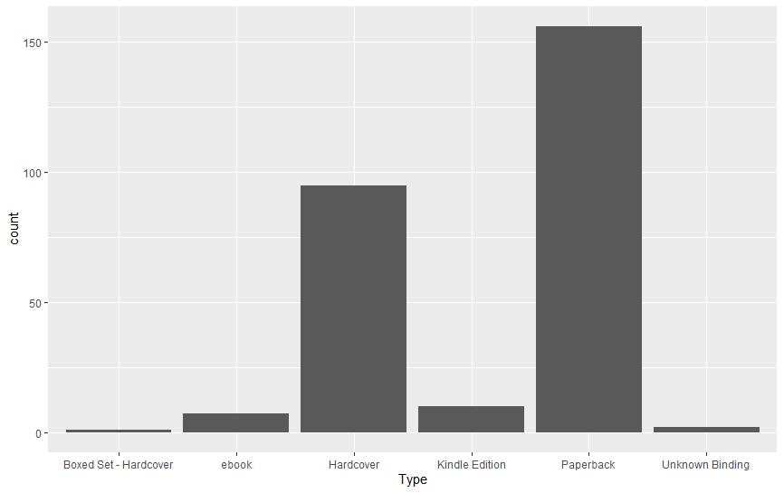
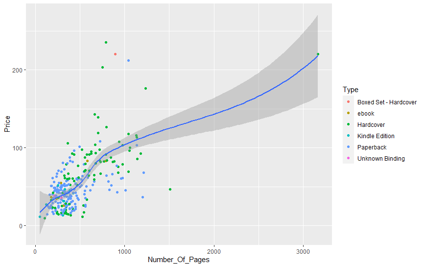

# R-Assignment 4

**Created by Chotiphat Pianpatanavit (ID: 63130500025)**

Chosen Dataset: Top 270 Computer Science / Programing Books (Data from Thomas Konstantin, [Kaggle](https://www.kaggle.com/thomaskonstantin/top-270-rated-computer-science-programing-books)) >> [Using CSV](https://raw.githubusercontent.com/safesit23/INT214-Statistics/main/datasets/prog_book.csv)


### Outlines
1. Explore the dataset
2. Learning function from Tidyverse
3. Transform data with dplyr and finding insight the data
4. Visualization with GGplot2

## Part 1: Explore the dataset

```
# Library
library(dplyr)
library(readr)
library(stringr)
library(tidyr)
library(assertive)
library(ggplot2)

# Dataset
TopCompSciBooks <- read_csv("https://raw.githubusercontent.com/safesit23/INT214-Statistics/main/datasets/prog_book.csv")
```

In this dataset has 271 Rows and 7 Columns.
```
Rows: 271
Columns: 7
$ Rating          <dbl> 4.17, 4.01, 3.33, 3.97, 4.06, 3.84, 4.09, 4.15, 3.87, 4.62, 4.03, 3.78, 3.73, 3.87, 3.87, 3.95,~
$ Reviews         <dbl> 3829, 1406, 0, 1658, 1325, 117, 5938, 1817, 2093, 0, 160, 481, 33, 1255, 593, 417, 80, 279, 370~
$ Book_title      <chr> "The Elements of Style", "The Information: A History, a Theory, a Flood", "Responsive Web Desig~
$ Description     <chr> "This style manual offers practical advice on improving writing skills. Throughout, the emphasi~
$ Number_Of_Pages <dbl> 105, 527, 50, 393, 305, 288, 256, 368, 259, 128, 352, 352, 200, 328, 240, 288, 392, 304, 336, 5~
$ Type            <chr> "Hardcover", "Hardcover", "Kindle Edition", "Hardcover", "Kindle Edition", "Paperback", "Hardco~
$ Price           <dbl> 9.323529, 11.000000, 11.267647, 12.873529, 13.164706, 14.188235, 14.232353, 14.364706, 14.50294~
```

The details of this dataset can be seen from the table below:
| No. | Columns        | Type      | Explanation               |
|:---:|----------------|-----------|---------------------------|
|  1  | Rating         | numeric   | คะแนนหนังสือ |
|  2  | Reviews        | numeric   | รีวิวของหนังสือ |
|  3  | Book_title     | character | ชื่อหนังสือ |
|  4  | Description    | character | คำอธิบายของหนังสือ |
|  5  | Number_Of_Pages| numeric   | จำนวนหน้าของหนังสือ |
|  6  | Type           | character | ชนิดของหนังสือ |
|  7  | Price          | numeric   | ราคาหนังสือ |

## Part 2: Learning function from Tidyverse

- Function `select()` from package [dplyr](https://dplyr.tidyverse.org/articles/dplyr.html#select-columns-with-select)). It is used for selecting columns
> TopCompSciBooks %>% select(Book_title, Rating)

#### Result:
```
   Book_title                                                                             Rating
   <chr>                                                                                   <dbl>
 1 The Elements of Style                                                                    4.17
 2 The Information: A History, a Theory, a Flood                                            4.01
 3 Responsive Web Design Overview For Beginners                                             3.33
 4 Ghost in the Wires: My Adventures as the World's Most Wanted Hacker                      3.97
 5 How Google Works                                                                         4.06
 6 The Meme Machine                                                                         3.84
 7 Start with Why: How Great Leaders Inspire Everyone to Take Action                        4.09
 8 Algorithms to Live By: The Computer Science of Human Decisions                           4.15
 9 Weapons of Math Destruction: How Big Data Increases Inequality and Threatens Democracy   3.87
10 ZX Spectrum Games Code Club: Twenty fun games to code and learn                          4.62
# ... with 261 more rows
```

- Function `str_subset()` from package [stringr](https://stringr.tidyverse.org/reference/str_subset.html)). It is used for finding strings that contains the said string.
> str_detect(TopCompSciBooks$Book_title, "Web")

#### Result:
```
[1] "Responsive Web Design Overview For Beginners"                                               
[2] "Agile Web Development with Rails: A Pragmatic Guide"                                        
[3] "Build Web Applications with Java: Learn every aspect to build web applications from scratch"
[4] "PHP and MySQL Web Development (Developer's Library)"   
``````

## Part 3: Transform data with dplyr and finding insight the data

### Q1.) หาค่าเฉลี่ยคะแนนของหนังสือ และค่าเฉลี่ยราคาของหนังสือ
```
mean(TopCompSciBooks$Rating)
mean(TopCompSciBooks$Price)
```
#### Result:
```
> mean(TopCompSciBooks$Rating)
[1] 4.067417
> mean(TopCompSciBooks$Price)
[1] 54.54186
```
#### Summary:
- ค่าเฉลี่ยคะแนนของหนังสืออยู่ที่ 4.07
- ค่าเฉลี่ยราคาของหนังสืออยู่ที่ 54.54 USD

### Q2.) หาราคาเฉลี่ยของหนังสือแต่ละชนิด
```
TopCompSciBooks %>% select(Type, Price) %>% group_by(Type) %>% 
  summarise(AvgPrice = mean(Price))
```
#### Result:
```
  Type                  AvgPrice
  <chr>                    <dbl>
1 Boxed Set - Hardcover    220. 
2 ebook                     51.4
3 Hardcover                 70.1
4 Kindle Edition            32.4
5 Paperback                 45.8
6 Unknown Binding           37.2
```
#### Summary:
- ชนิดของหนังสือที่มีราคาแพงที่สุดอย่างมากคือ Boxed Set - Hardcover
- ชนิดของหนังสือที่มีราคาแพงที่สุดคือ Hardcover
- ชนิดของหนังสือชนิดอื่นๆ มีราคาค่อนข้างใกล้เคียงกัน

### Q3.) หาชื่อของหนังสือที่มีจำนวนรีวิวสูงสุด 10 อันดับ และคะแนนของหนังสือเล่มนั้น
```
TopCompSciBooks %>% select(Book_title, Rating) %>%
  slice_max(TopCompSciBooks$Reviews, n=10)
```
#### Result:
```
   Book_title                                                                                Rating
   <chr>                                                                                      <dbl>
 1 Start with Why: How Great Leaders Inspire Everyone to Take Action                           4.09
 2 The Elements of Style                                                                       4.17
 3 The Phoenix Project: A Novel About IT, DevOps, and Helping Your Business Win                4.27
 4 The Goal: A Process of Ongoing Improvement                                                  4.05
 5 Weapons of Math Destruction: How Big Data Increases Inequality and Threatens Democracy      3.87
 6 The Innovators: How a Group of Hackers, Geniuses and Geeks Created the Digital Revolution   4.1 
 7 Algorithms to Live By: The Computer Science of Human Decisions                              4.15
 8 Ghost in the Wires: My Adventures as the World's Most Wanted Hacker                         3.97
 9 The Information: A History, a Theory, a Flood                                               4.01
10 How Google Works                                                                            4.06
```
#### Summary:
- หนังสือที่มีจำนวนรีวิวมาก ยังคงมีคะแนนใกล้เคียงกับคะแนนเฉลี่ยข้างต้น (4.07)

### Q4.) หาชื่อของหนังสือที่มีคำว่า "Web" ในคำอธืบายหนังสือ และเรียงลำดับราคาหนังสือจากมากไปน้อย
```
TopCompSciBooks %>% select(Book_title, Price) %>%
  filter(str_detect(TopCompSciBooks$Description, tolower("web"))) %>% arrange(desc(Price))
```
#### Result:
```
   Book_title                                                                                  Price
   <chr>                                                                                       <dbl>
 1 Programming PHP                                                                              69.3
 2 PHP and MySQL Web Development (Developer's Library)                                          45.3
 3 Big Data: Principles and best practices of scalable realtime data systems                    43.3
 4 Build Web Applications with Java: Learn every aspect to build web applications from scratch  42.3
 5 The Elements of Computing Systems: Building a Modern Computer from First Principles          41.3
 6 Sams Teach Yourself Perl in 24 Hours                                                         38.2
 7 High Performance Browser Networking                                                          37.7
 8 CSS: The Missing Manual                                                                      35.1
 9 Eloquent JavaScript: A Modern Introduction to Programming                                    31.0
10 Sams Teach Yourself JavaScript in 24 Hours                                                   27.8
11 Agile Web Development with Rails: A Pragmatic Guide                                          24.5
12 Nine Algorithms That Changed the Future: The Ingenious Ideas That Drive Today's Computers    22.4
13 Help Your Kids with Computer Coding                                                          18.9
14 Responsive Web Design Overview For Beginners                                                 11.3
```
#### Summary:
- มีจำนวนของหนังสือที่เกี่ยวข้องกับ "Web" แค่ 14 เล่ม
- หนังสือที่เกี่ยวข้องกับ "Web" มีราคาที่หลากหลาย ตั้งแต่ 11.3 ไปจนถึง 69.3 USD
- หนังสือที่เกี่ยวข้องกับ "Web" อาจไม่มีคำว่า "Web" ในชื่อหนังสือก็ได้

### Q5.) หาชื่อของหนังสือที่มีจำนวนหน้าสูงสุด 10 อันดับ คำอธิบาย และจำนวนหน้าของหนังสือเล่มนั้น
```
TopCompSciBooks %>% select(Book_title, Description, Number_Of_Pages) %>%
  slice_max(Number_Of_Pages , n=10)
```
#### Result:
```
   Book_title                                                                    Description              Number_Of_Pages
   <chr>                                                                         <chr>                              <dbl>
 1 The Art of Computer Programming, Volumes 1-4a Boxed Set                       "\"The bible of all fun~            3168
 2 The Linux Programming Interface: A Linux and Unix System Programming Handbook "The Linux Programming ~            1506
 3 Numerical Recipes: The Art of Scientific Computing                            "Co-authored by four le~            1235
 4 Learning Python                                                               "Portable, powerful, an~            1214
 5 Beginning Java 2                                                              "What is this book abou~            1200
 6 Introduction to Algorithms                                                    "This title covers a br~            1180
 7 Database System Concepts                                                      "Intended for a first c~            1142
 8 Modern Operating Systems, 4th Edition                                         "\"Modern Operating Sys~            1136
 9 The C++ Standard Library: A Tutorial and Reference                            "The Best-Selling C++ R~            1136
10 Artificial Intelligence: A Modern Approach                                    "For one or two-semeste~            1132
```
#### Summary:
- หนังสือที่มีจำนวนหน้ามาก มักเป็นหนังสือเกี่ยวกับการ Programming โดยกว้าง เช่น Programming Language/Library หรือ Introduction/Tutorial
- หนังสือที่มีจำนวนหน้ามากมีหน้าประมาณ 1000 หน้าขึ้นไป และหนังสือที่มีจำนวนหน้าสูงสุด มีถึง 3168 หน้า

### Q6.) หาจำนวนของหนังสือที่ไม่มีรีวิวเลย
```
NoReview <- filter(TopCompSciBooks, Reviews == 0)
count(NoReview)
```
#### Result:
```
  <int>
1    22
```
#### Summary:
- มีหนังสือที่ยังไม่ได้ผ่านการรีวิวเลยอยู่ถึง 22 เล่ม

## Part 4: Visualization with GGplot2
### Graph 1.) Histogram: The amount of programming books in each type.
```
Histogram <- ggplot(TopCompSciBooks, aes(x=Type)) + geom_bar()
Histogram
```
#### Result:


### Graph 2.) Scat Plot: Relation between the number of pages and price, and also the type of books.
```
ScatPlot <- TopCompSciBooks %>% ggplot(aes(x=Number_Of_Pages, y=Price)) +
  geom_point(aes(color=Type))
ScatPlot+geom_smooth()
```
#### Result:


