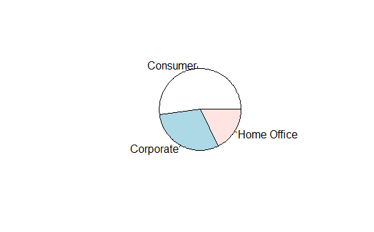
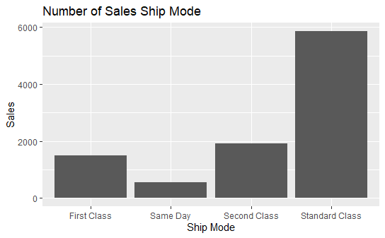

# R-Assignment 4

**Created by Naruebadin Ameenee (ID: 63130500067)**

Dataset from: Superstore Sales Dataset (Data from Rohit Sahoo,[Kaggle](https://www.kaggle.com/rohitsahoo/sales-forecasting)) >> [Using CSV](https://raw.githubusercontent.com/safesit23/INT214-Statistics/main/datasets/superstore_sales.csv)


### Outlines
1. Explore the dataset
2. Learning function from Tidyverse
3. Transform data with dplyr and finding insight the data
4. Visualization with GGplot2

## Part 1: Explore the dataset
###Context
>Retail dataset of a global superstore for 4 years.
Perform EDA and Predict the sales of the next 7 days from the last date of the Training dataset!
```
# Library
library(dplyr)
library(readr)
library(stringr)
library(tidyr)
library(assertive)
library(ggplot2)
library(DescTools)

# Dataset
Superstore_Sales <- read_csv("https://raw.githubusercontent.com/safesit23/INT214-Statistics/main/datasets/superstore_sales.csv");
```
### Content
>In this dataset has 9,800 rows and 18 columns to store data about retail dataset of a global superstore for 4 years that contain
```
$ `Row ID`        <dbl> 1, 2, 3, 4, 5, 6, 7, 8, 9, 10, 11, 12, 13, 14, 15, 16, 17, 18, 19, 20, 21, 22, 23, 24, 25, 26, 27, 28, 2~
$ `Order ID`      <chr> "CA-2017-152156", "CA-2017-152156", "CA-2017-138688", "US-2016-108966", "US-2016-108966", "CA-2015-11581~
$ `Order Date`    <chr> "08/11/2017", "08/11/2017", "12/06/2017", "11/10/2016", "11/10/2016", "09/06/2015", "09/06/2015", "09/06~
$ `Ship Date`     <chr> "11/11/2017", "11/11/2017", "16/06/2017", "18/10/2016", "18/10/2016", "14/06/2015", "14/06/2015", "14/06~
$ `Ship Mode`     <chr> "Second Class", "Second Class", "Second Class", "Standard Class", "Standard Class", "Standard Class", "S~
$ `Customer ID`   <chr> "CG-12520", "CG-12520", "DV-13045", "SO-20335", "SO-20335", "BH-11710", "BH-11710", "BH-11710", "BH-1171~
$ `Customer Name` <chr> "Claire Gute", "Claire Gute", "Darrin Van Huff", "Sean O'Donnell", "Sean O'Donnell", "Brosina Hoffman", ~
$ Segment         <chr> "Consumer", "Consumer", "Corporate", "Consumer", "Consumer", "Consumer", "Consumer", "Consumer", "Consum~
$ Country         <chr> "United States", "United States", "United States", "United States", "United States", "United States", "U~
$ City            <chr> "Henderson", "Henderson", "Los Angeles", "Fort Lauderdale", "Fort Lauderdale", "Los Angeles", "Los Angel~
$ State           <chr> "Kentucky", "Kentucky", "California", "Florida", "Florida", "California", "California", "California", "C~
$ `Postal Code`   <dbl> 42420, 42420, 90036, 33311, 33311, 90032, 90032, 90032, 90032, 90032, 90032, 90032, 28027, 98103, 76106,~
$ Region          <chr> "South", "South", "West", "South", "South", "West", "West", "West", "West", "West", "West", "West", "Sou~
$ `Product ID`    <chr> "FUR-BO-10001798", "FUR-CH-10000454", "OFF-LA-10000240", "FUR-TA-10000577", "OFF-ST-10000760", "FUR-FU-1~
$ Category        <chr> "Furniture", "Furniture", "Office Supplies", "Furniture", "Office Supplies", "Furniture", "Office Suppli~
$ `Sub-Category`  <chr> "Bookcases", "Chairs", "Labels", "Tables", "Storage", "Furnishings", "Art", "Phones", "Binders", "Applia~
$ `Product Name`  <chr> "Bush Somerset Collection Bookcase", "Hon Deluxe Fabric Upholstered Stacking Chairs, Rounded Back", "Sel~
$ Sales           <dbl> 261.9600, 731.9400, 14.6200, 957.5775, 22.3680, 48.8600, 7.2800, 907.1520, 18.5040, 114.9000, 1706.1840,~
```

| No. | Columns        | Type     | Explanation               |
|:---:|----------------|----------|---------------------------|
|  1  | Row ID         | numeric  | ลำดับของข้อมูล |
|  2  | Order ID       | character| ID ของออเดอร์ |
|  3  | Order Date     | character| วันที่สั่งสินค้า |
|  4  | Ship Date      | character| วันที่จัดส่ง |
|  5  | Ship mode      | character| รูปแบบการจัดส่ง |
|  6  | Customer ID    | character| ID ของลูกค้า |
|  7  | Customer Name  | character| ชื่อของลูกค้า |
|  8  | Segment        | character| ประเภทของลูกค้า |
|  9  | Country        | character| ประเทศที่ลูกค้าต้องการจัดส่ง |
|  10  | City          | character| เมืองที่ลูกค้าต้องการจัดส่ง |
|  11  | State         | character| รัฐที่ลูกค้าต้องการจัดส่ง  |
|  12  | Postal Code   | numeric  | รหัสไปรษณีย์ที่ลูกค้าต้องการจัดส่ง |
|  13  | Region        | character| ภูมิภาคที่ลูกค้าต้องการจัดส่ง |
|  14  | Product ID    | character| ID ของสินค้า |
|  15  | Category      | character| หมวดหมู่ของสินค้า |
|  16  | Sub Category  | character| หมวดหมู่ย่อยของสินค้า |
|  17  | Product Name  | character| ชื่อสินค้า |
|  18  | Sales         | numeric  | ราคาของสินค้า |

## Part 2: Transform data with dplyr and finding insight the data
### 1. หาจำนวนหมวดหมู่ย่อยของสินค้าที่ขายได้ทั้งหมด

```
countSub <- Superstore_Sales %>% select(`Sub-Category`) %>% count(`Sub-Category`) %>% arrange(n)
as_tibble(countSub)
```
Explain:
  - select เลือกให้แสดงข้อมูลเฉพาะ Sub-Category
  - count เป็นการบอกจำนวนของ Sub-Category
  - ใช้ arrange เพื่อเรียงลำดับจากจำนวณสินค้าน้อยไปมาก

Result:

```
`Sub-Category`     n
   <chr>          <int>
 1 Copiers           66
 2 Machines         115
 3 Supplies         184
 4 Fasteners        214
 5 Bookcases        226
 6 Envelopes        248
 7 Tables           314
 8 Labels           357
 9 Appliances       459
10 Chairs           607
11 Accessories      756
12 Art              785
13 Storage          832
14 Phones           876
15 Furnishings      931
16 Paper           1338
17 Binders         1492
```
### 2. สินค้า ID OFF-AR-10000246 มีชื่อสินค้าว่าอะไร ถูกสั่งซื้อโดยใครบ้าง และถูกส่งไปที่ไหนบ้าง
```
ProductId <- Superstore_Sales %>% select(`Customer Name`,`Product ID`,`Product Name`, City) %>% 
  filter(`Product ID` == "OFF-AR-10000246")
as_tibble(ProductId)
```
Explain:
  - select เพื่อเลื่อกให้แสดง column Customer Name, Product ID, Product Name และ City
  - flitter ระบุว่า Product ID คือ OFF-AR-10000246
 สินค้านี้มีชื่อว่า Newell 318 ซึงมีลูกค้าสั่งซื้ออยู่ 5 รายคือ 
  - Ken Black จากเมือง Fremont
  - Nora Preis จากดมือง San Francisco
  - Larry Hughes จากเมือง Chandler
  - Alyssa Tate จากเมือง Meriden
  - Barry Gunzalez จากเมือง Springfield
Result:
```
`Customer Name` `Product ID`    `Product Name` City         
  <chr>           <chr>           <chr>          <chr>        
1 Ken Black       OFF-AR-10000246 Newell 318     Fremont      
2 Nora Preis      OFF-AR-10000246 Newell 318     San Francisco
3 Larry Hughes    OFF-AR-10000246 Newell 318     Chandler     
4 Alyssa Tate     OFF-AR-10000246 Newell 318     Meriden      
5 Barry Gonzalez  OFF-AR-10000246 Newell 318     Springfield  
```

### 3. ลูกค้าคนใดซื้อสินค้าที่ราคาถูกที่สุด
```
lowestPrice <- Superstore_Sales %>% select(`Customer Name`,`Product ID`,`Product Name`,Sales) %>% 
  filter(Sales == min(Sales))

as_tibble(lowestPrice)
```
Explain:
  - select ใช้เพื่อแสดงรายการข้อมูลของ Customer Name,Prduct ID, Prduct Name และ Sales
  - filter ใช้เพื่อระบุราคาสินค้าที่ถูกที่สุด
Result:
```
`Customer Name`  `Product ID`    `Product Name`                                                             Sales
  <chr>            <chr>           <chr>                                                                      <dbl>
1 Zuschuss Carroll OFF-AP-10002906 Hoover Replacement Belt for Commercial Guardsman Heavy-Duty Upright Vacuum 0.444
```
### 4. ปีที่มีการขนส่งสินค้ามากที่สุด 3 อันดับแรก
```
Superstore_Sales$`Ship Date` <- as.Date(as.character(Superstore_Sales$`Ship Date`), "%d/%m/%Y")
class(Superstore_Sales$`Ship Date`)

Superstore_Sales$`Ship Year` <- format(Superstore_Sales$`Ship Date`, "%Y")
Top3ShipYear <-Superstore_Sales %>% select(`Ship Year`) %>% count(`Ship Year`) %>% arrange(desc(n)) %>% slice(1:3)
as_tibble(Top3ShipYear)
```
Explain:
 - เปลี่ยน class ของ Ship Date จาก char ให้กลายเป็น Date
 - สร้าง column ขึ้นมาใหม่(Ship Year) เพื่อเก็บค่าปีโดยใช้ format
ปีที่มีการส่งสินค้ามากที่สุด 3 อันดับแรกคือ
 - ปี 2018 จำนวน 3249 ชิ้น
 - ปี 2017 จำนวน 2534 ชิ้น
 - ปี 2016 จำนวน 2055 ชิ้น
Result:
```
`Ship Year`     n
  <chr>       <int>
1 2018         3249
2 2017         2524
3 2016         2083
```

### 5. ประเภทของสินค้าที่ขายดีเป็นอันดับหนึ่ง
```
Top1Category <- Mode(Superstore_Sales$Category)
as_tibble(Top1Category);
```
Explain:
 - ใช้ Mode เพื่อหาฐานนิยมของ Category
 ประเภทของสินค้าที่ขายดีเป็นอันดับหนึ่ง คือ Office Supplies
Result: 
```
value          
  <chr>          
1 Office Supplies
```
## Part 3: Visualization with GGplot2
### 1.) Graph show proportional division of segment customer
```
Segment <- table(Superstore_Sales$Segment)
  Segment
  pie(Segment)
```
Result:



### 2.) Graph show relation between Ship Mode and sale
```
Shipplot <- ggplot(Superstore_Sales, aes(x= `Ship Mode`)) + geom_bar(); 
  
  Shipplot + ggtitle("Number of Sales Ship Mode") +
    xlab("Ship Mode") + ylab("Sales")
```
Result:

